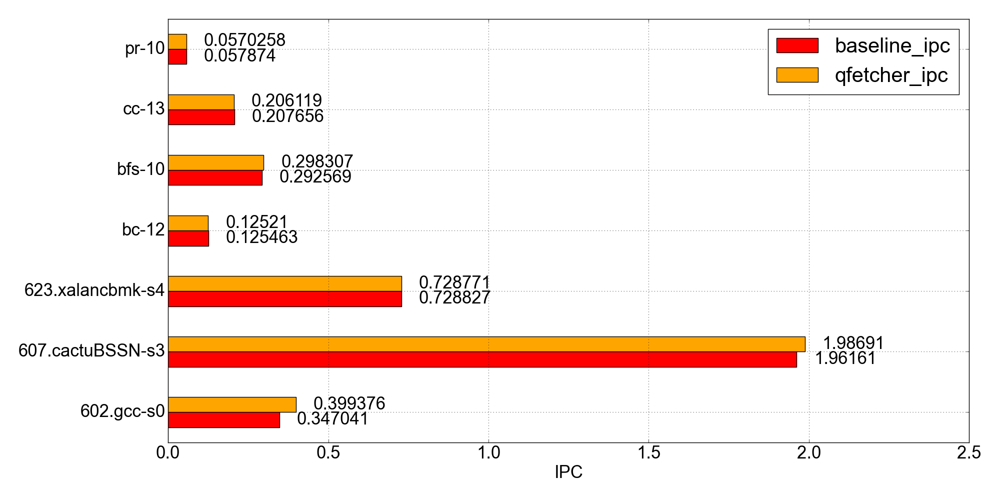
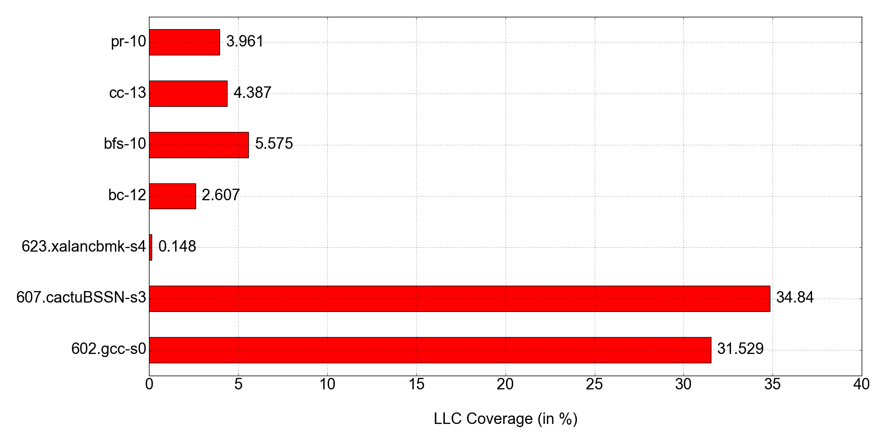

# Q-fetcher

*Q-Fetcher* is an experimental prototype of a simple reinforcement-learning based hardware prefetcher
for CPU caches, which relies on Tabular Q-Learning to (hopefully) learn to prefetch particular cache blocks 
whose usage frequency would be the most in the near future. It does not require any pre-training, but instead learns
on the fly, i.e. online. 
It borrows ideas from [Signature Path Prefetcher (SPP)](https://ieeexplore.ieee.org/document/7783763)
and [Instruction Pointer Classifier-based Spatial Hardware Prefetching (IPCP)](https://ieeexplore.ieee.org/document/9138971)
to represent the sequence of *deltas* (difference between cache block # of consecutive accesses) as compressed
fixed-width *signatures*. 

**NOTE:** The objective was not to break any records, but to see if applying a (naive and a straightforward) 
reinforcement-learning approach, which can be implemented and used practically in real-life, into cache prefetching 
would yield better results when compared to a baseline system with 
no prefetching. The results from small-scale experiments are promising (see below) and there is a lot of room for improvement.

## Load Traces
The dataset consists of the LLC (*Last-Level Cache*) accesses (along with instruction IDs and other values) from 
several memory-intensive benchmarks by SPEC-2006, SPEC-2017 and GAP benchmark suites, which can be found on the competition
website [here](https://sites.google.com/view/mlarchsys/isca-2021/ml-prefetching-competition?authuser=0).

- Download any of the trace (`.xz` files inside `Load Traces/*/` directories), extract it and place the extracted `.txt` file inside `q-fetcher/traces/` directory.
- Inside `q-fetcher/config.json`, set the name of the trace file accordingly.

## Usage
(Recommended that a virtual environment is set up before proceeding further)

- Install the dependencies: `pip3 install requirement.txt`
- Place the appropriate trace file(s) into `q-fetcher/traces/` directory, as mentioned above
- (Optional) Change the parameters inside `q-fetcher/config.json` file related to the prefetcher
- Execute `q-fetcher/main.py` to start the prefetcher: `python3 main.py`

## Output
The output files will be stored to `q-fetcher/output/*.txt` and will replace previous files
(unless the name is changed inside `q-fetcher/config.json`). The output files consist of
1. Prefetch Addresses, in the format as specified in the competition's website.
2. Q-values of the corresponding prefetched addresses, just for the sake of debugging.

To evaluate the performance of the prefetcher, follow the instructions from 
[this repository](https://github.com/Quangmire/ChampSim).

## Results
Following are the results of the small-scale experiements conducted on benchmarks from SPEC2017 and GAP benchmark
suites, downloaded from the link mentioned in [*Load Traces*](#load-traces) section. The baseline used for comparison 
is a system with no prefetching. 

All the results were obtained from
ChampSim simulator (see [*Output*](#output) section) with default configurations and run with
- **20M** warmup instructions
- **80M** simulation instructions

### 1. IPC Comparison

*IPC* (Intructions Per Clock) is defined as
> Average number of instructions executed per clock-cycle

| Benchmark      | Baseline IPC | Q-Fetcher IPC | Obtained Speedup |
|----------------|-------------|--------------|-----------------|
*602.gcc-s0*       |  0.347041    | 0.399376      | 1.150804
*607.cactuBSSN-s3* |  1.961610    | 1.986910      | 1.012898
*623.xalancbmk-s4* |  0.728827    | 0.728771      | 0.999923
*bc-12*            |  0.125463    | 0.125210      | 0.997983
*bfs-10*           |  0.292569    | 0.298307      | 1.019612
*cc-13*            |  0.207656    | 0.206119      | 0.992598
*pr-10*            |  0.057874    | 0.057026      | 0.985344

where, Speedup is calculated as `(q_fetcher_ipc / baseline_ipc)`. Summarizing the speedups obtained,
> Geometric Mean of IPC Speedup: **1.0214**

 

### 2. LLC Coverage
*Coverage* is defined as 
> Fraction of hits in the cache, which would have otherwise missed on a system with no prefetching

Summarizing the LLC coverages obtained,
> Geometric Mean of coverage: **4.561**%